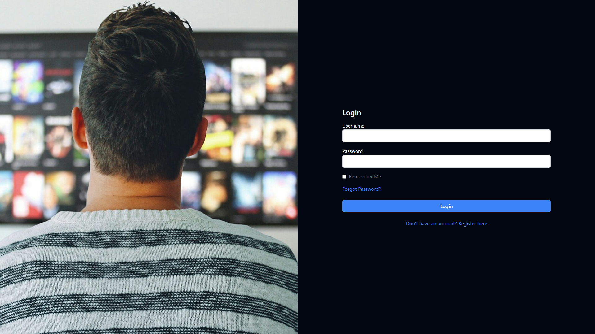
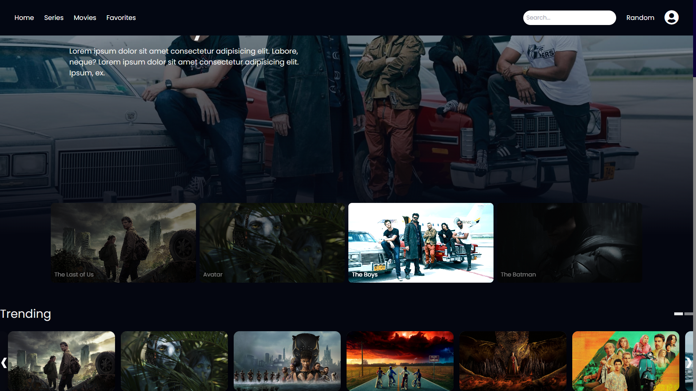
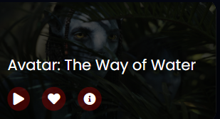
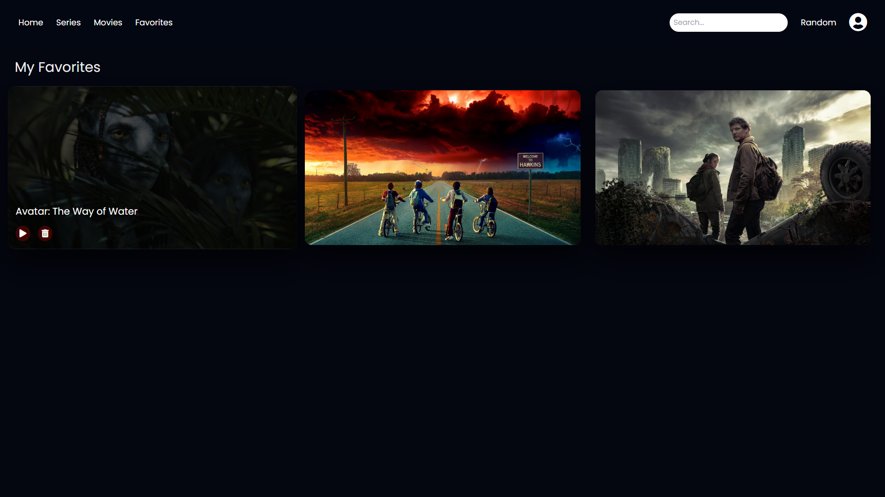
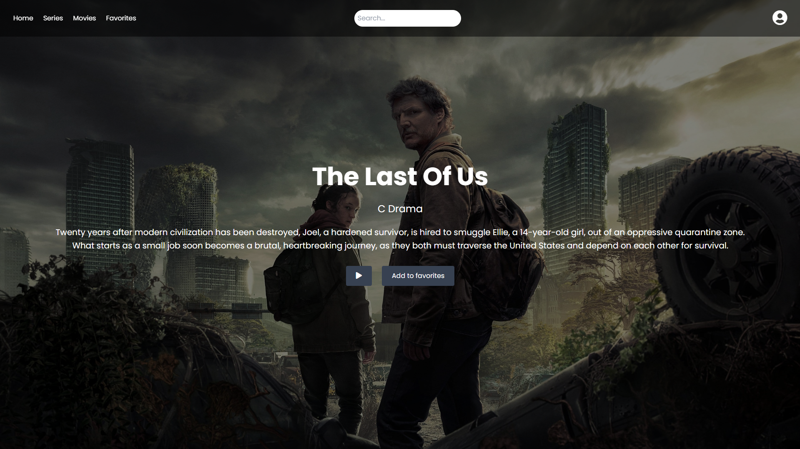
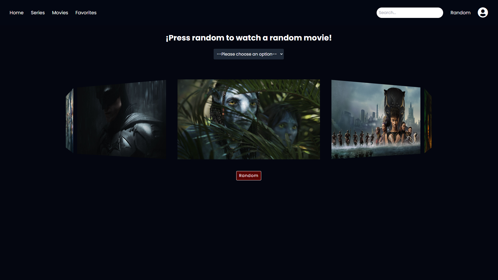

# Veuw - Hub de Películas

## Descripción

Veuw es una aplicación de streaming de películas y series. Este proyecto es parte de un sprint de dos semanas y está desarrollado utilizando HTML, CSS, JavaScript y Tailwind CSS.

## Características

- **Desplazamiento automático**: Una galería de imágenes con desplazamiento horizontal suave.
- **Efectos de Hover**: Al pasar el mouse sobre una película, aparecen opciones de reproducción y me gusta, junto con un título estilizado.
- **Carousel de películas**: Se me ocurrió crear un carrusel que le diera la opción a los usuarios de ver una película random.
- **Reproductor de video**: En los sliders de las películas se muestra la opción para reproducir video y este te lleva a un reproductor de YouTube.
- **Diseño Responsivo**: Utiliza Tailwind CSS para garantizar que la aplicación sea responsiva en diferentes dispositivos y tamaños de pantalla.

## Tecnologías Utilizadas

- **HTML**
- **CSS**
- **JavaScript**
- **Tailwind CSS**

## Instalación

1. Clona el repositorio:
    ```sh
    git clone https://github.com/tu-usuario/veuw.git
    ```
2. Navega al directorio del proyecto:
    ```sh
    cd veuw
    ```
3. Instala las dependencias necesarias utilizando `npm`:
    ```sh
    npm install
    ```
4. Genera el archivo CSS de Tailwind:
    ```sh
    npm run build:css
    ```
5. Abre `inicio/inicio.html` en tu navegador.

## Uso
1. Al abrir la aplicación, se te pedirá iniciar sesión para que puedas entrar a la ventana principal.
2. Tendrás que registrarte primero y luego iniciar sesión con esas credenciales.



3. Al iniciar sesión, se mostrará la página principal con una selección de películas destacadas.



4. En la parte inferior se mostrará un slider con diferentes películas.

5. Pasa el mouse sobre una película para ver las opciones de reproducción, me gusta y más información.



6. En el header puedes navegar a la sección de series y películas, estos tendrán sliders que cumplen la misma función.

7. En el header podrás ver una sección de favoritos, aquí se guardarán todas las películas y series que marques como favoritas al clickear el corazón.



8. Podrás ver más información sobre la película al hacer clic en el icono de más información.



9. Haz clic en el botón "Random" para obtener recomendaciones de películas aleatorias.



10. Si quieres cerrar sesión solo haz hover sobre el icono de perfil y clickea en logout.

## Proceso que segui para hacerlo

Primero, busqué cómo funcionaban plataformas populares y cuál era la idea de cómo lo quería hacer. Me puse a trabajar en el diseño investigando recursos en YouTube, CodePen y múltiples páginas que creí que podrían funcionar para mi proyecto. La primera parte que hice fue el inicio de la página, ya que considero que es lo más importante. Hice muchas variaciones de esta y distintos diseños en Figma. Decidí utilizar Tailwind porque es una librería que me gusta mucho y me iba a ayudar a trabajar con el CSS de una manera más rápida y eficiente.

Una vez hice la animación con los sliders de la página de inicio, que me llevó bastante tiempo, venía lo más complicado: el slider de películas. Me parece muy eficiente cómo trabajan el slider plataformas como Netflix o Prime Video, así que encontré la forma de hacerlo similar e igual de eficiente. Una vez terminado, me puse a realizar las demás vistas, asegurándome de que fueran responsivas y funcionales.

Pensé en formas de mejorar mi página y se me ocurrió una idea de crear un carrusel de películas para cuando estás con amigos y no sabes qué película ver, y la implementé en mi proyecto. También utilicé la versión de ChatGPT-4o para que me ayudara a implementar recursos de CodePen, ya que algunos estaban hechos en distintos frameworks como Vue o React y no sabía cómo implementarlos.

## Sprint Review

| ¿Qué salió bien? | ¿Qué puedo hacer diferente? | ¿Qué no salió bien? |
|------------------|-----------------------------|---------------------|
| Secciones personalizadas: Cada sección tiene un diseño atractivo y fácil de utilizar para los usuarios. | En este sprint aprendí más sobre el diseño responsivo así que ahora utilizaré estos conocimientos para ahorrar mucho tiempo, como por ejemplo el uso de media queries. | El buscador no es funcional, aunque más adelante lo cambiaremos porque actualmente no estoy utilizando APIs y bases de datos porque lo veo más fácil y óptimo ya que utilicemos un framework como Angular. Pude haber implementado un buscador temporal. |
| Efectos de hover y transición logrados. | Realizar reuniones de seguimiento. | La parte de categorías aún no tiene una función en el carrusel. |
| Buena gestión del tiempo en la mayoría de las tareas. | Mejorar la documentación del código. | Los diseños de algunos botones y textos pudieron ser más atractivos. |
| Implementación del diseño responsivo: la página es responsiva en todas las pantallas a excepción de los celulares ya que no se nos pidió para este sprint. | Organizar un poco mejor mi trabajo. |  |
| La idea del carrusel de películas me parece muy útil y creativa. | Organizar mejor mis tiempos. |  |
